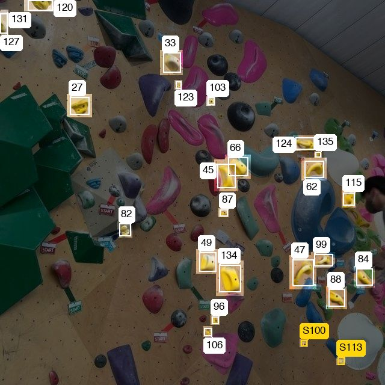
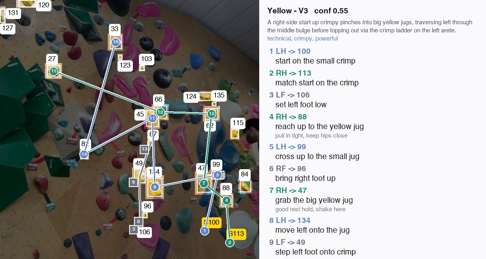

# climbML

Takes a photo of a climbing wall, finds the holds, groups them into a single
route by colour, and generates a move-by-move sequence for climbing it.

```
photo ──▶ hold detection ──▶ route isolation ──▶ beta generation
          YOLO26n            colour clustering    VLM + Set-of-Mark
          fine-tune          + prominence         + schema validation
```

Only the first stage is trained. Route isolation is colour rules, and beta
generation is a prompted vision-language model with a validated response schema.



*Route isolation: 25 yellow holds separated from the rest of the wall and
numbered. This image plus the same holds as JSON is what gets sent to the model.
The numbers are how it refers to a hold.*



*Generated beta: one track per limb, nodes numbered in move order, move list
alongside. Wall photo from the dataset (CC BY 4.0).*

## Results

YOLO26n fine-tuned for 120 epochs at 640px (run `y26n-640-v12-a`):

| split | mAP50 | mAP50-95 | hold AP50 | volume AP50 |
|-------|-------|----------|-----------|-------------|
| val   | 0.877 | 0.685    | 0.896     | 0.859       |
| test  | 0.871 | 0.672    | 0.887     | 0.855       |

Per-image means at conf 0.25 on val: precision 0.90, recall 0.88. Inference
6.1 ms/image on an M3 Pro. Weights 5.4 MB, or 4.8 MB exported to CoreML fp16.
val and test agree, so the model is not overfit to the validation split.

### The dataset labels were partly corrupted

Ranking the validation split by per-image recall turned up images where the
detections were correct but recall was near zero. Those annotations had been
drawn on a rotated copy of the pixels, an EXIF-orientation bug upstream.

`climbml repair-labels` tests each 90-degree transform of the labels against the
model's predictions and rewrites the ones where the match is unambiguous. It
repaired 5 images and flagged 4 more as unfixable. Measured hold AP50 had been
understated by 13 points: 0.764 before, 0.896 after. See
[docs/experiments.md](docs/experiments.md).

### Beta generation

Claude Sonnet 5 with structured outputs, compared over 11 curated routes at four
thinking and effort settings. Adaptive thinking at `low` effort won: 10-20 s and
about 2 cents per route. `medium` took 31-70 s for marginal gains. Default (high)
effort returned nothing at all, because it spends the whole token budget
thinking.

## Install

```bash
python3.12 -m venv .venv && source .venv/bin/activate
pip install -e ".[train,beta]"
```

The base install is numpy, Pillow and PyYAML only, so the route and beta code can
be imported and tested without PyTorch. `[train]` adds ultralytics, OpenCV and
matplotlib. `[beta]` adds the Anthropic SDK.

## Use

```bash
climbml explore                              # dataset composition, class balance, sample grids
climbml train --smoke                        # 1-epoch pipeline check
climbml train                                # 120 epochs, early stop at 30
climbml eval runs/detect/y26n-640-v12-a      # metrics + worst-image error analysis
climbml repair-labels runs/detect/y26n-640-v12-a --apply
climbml export runs/detect/y26n-640-v12-a --format coreml

climbml colors path/to/wall.jpg              # per-hold HSV and colour bin
climbml beta-prep                            # build payloads and renders, no API calls
climbml beta-run --variant low               # generate, score and render beta
climbml beta-report                          # scoreboard across saved runs
```

`beta-run` needs `ANTHROPIC_API_KEY`. Everything else runs offline. Paths come
from `climbml/config.py` and can be overridden with `CLIMBML_DATASET`,
`CLIMBML_WEIGHTS`, `CLIMBML_RUNS` and `CLIMBML_ARTIFACTS`.

## Layout

```
src/climbml/
  config.py            paths and device resolution
  data/                dataset exploration; label repair
  detect/              training, evaluation, per-image metrics, export + parity check
  route/               colour sampling, clustering into routes, Set-of-Mark annotation
  beta/                response schema and prompt, generation, rendering, eval harness
configs/eval_routes.yaml   curated beta evaluation set
docs/experiments.md        every run, including the failed ones
docs/data-flywheel.md      design note: turning user corrections into training data
tests/                     no dataset or weights required
```

## Evaluating generated beta

A boulder problem has several valid sequences, so there is no ground-truth beta
to score against. Two checks stand in for it.

**Grounding**, checked first. The response schema forces `hold` to be an integer,
and `validate()` rejects plans that name holds not on the wall, or that start
somewhere other than the start holds. A failure triggers one repair round-trip
carrying the exact errors.

**Plausibility**, checked geometrically. `quality_report()` flags feet placed
above the hands, hands moving back down the wall, the same hand used twice in a
row, a route that never reaches the top hold, and reaches longer than a person
has.

Whether it is the sequence a climber would actually pick is judged by eye, from
the images the harness renders for every run.

## Dataset

[Climbing Holds and Volumes](https://universe.roboflow.com/blackcreed-xpgxh/climbing-holds-and-volumes)
v12 by Blackcreed, via Roboflow Universe. 1,650 images of indoor walls with
YOLO-format boxes for two classes, 60,804 boxes total, 13.9:1 hold to volume
imbalance. Licensed CC BY 4.0 and not included here — download it to
`data/climbing-holds-and-volumes/`, or point `CLIMBML_DATASET` elsewhere. Splits
after the label repair: 1,232 / 266 / 148.

Composition matters when reading the metrics. The set mixes catalog product shots
(one hold on a plain background), dense real walls (up to 272 boxes), and stock
photos with climbers in them. The test split is denser than train: 54.3 boxes per
image against 33.8.

## Tests

```bash
pip install -e ".[dev]" && pytest && ruff check src tests
```

67 tests against a synthetic wall and one captured real route. No dataset or
trained weights needed.

## Licence

MIT, see [LICENSE](LICENSE). The dataset is CC BY 4.0 and is not included.
